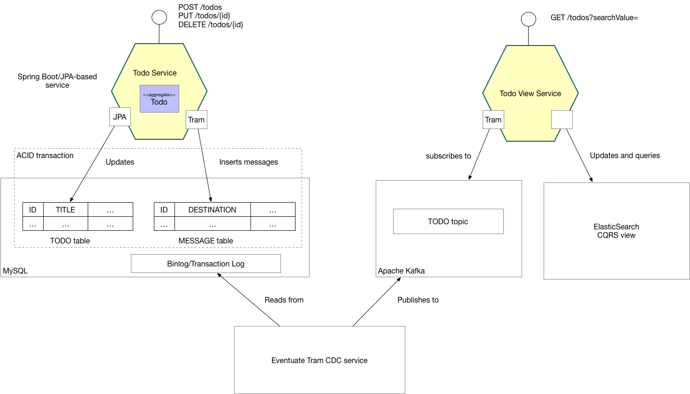

# Todo List example application


This example demonstrates how to develop microservices with Spring Boot, JPA, Apache Kafka, ElasticSearch and the Eventuate Tram framework.

## The problem: atomically updating data and publishing events/messages

It's challenging to atomically update a data (e.g. a Domain-Driven design aggregate) and publish a message, such as a domain event.
The traditional approach of using 2PC/JTA isn't a good fit for modern applications.

The [Eventuate&trade; Tram framework](https://github.com/eventuate-tram/eventuate-tram-core) implements an alternative mechanism based on the [Application Events](http://microservices.io/patterns/data/application-events.html) pattern.
When an application creates or updates data, as part of that ACID transaction, it inserts an event into an `EVENTS` or `MESSAGES` table.
A separate CDC process publishes those events to a message broker, such as Apache Kafka.


## About the Todo list application

The Todo List application, which lets users maintain a todo list, is the hello world application for the [Eventuate&trade; Tram framework](https://github.com/eventuate-tram/eventuate-tram-core).
It shows how use Eventuate Tram to

* reliably publish domain events as part of a database transaction that updates an aggregate.
* consume domain events to update a [CQRS view](http://microservices.io/patterns/data/cqrs.html) view

When a user creates or updates a todo, the application publishes a domain event.
An event handler, subscribes to those events and updates an ElasticSearch-based CQRS view.

## Todo list architecture

The Todo List application is built using

* Java
* JPA
* Eventuate Tram
* Spring Boot
* MySQL
* ElasticSearch
* Apache Kafka

The following diagram shows the application's architecture.



The application consists of two services:

* `Todo Service` - implements the REST endpoints for creating, updating and deleting todos.
The service persists the Todo JPA entity in MySQL.
Using `Eventuate Tram`, it publishes Todo domain events that are consumed by the `Todo View Service`.

* `Todo View Service` - implements a REST endpoint for querying the todos.
It maintains a CQRS view of the todos in ElasticSearch.

The `Todo Service` publishes events using Eventuate Tram.
Eventuate Tram inserts events into the `MESSAGE` table as part of the ACID transaction that updates the TODO table.
The Eventuate Tram CDC service tracks inserts into the `MESSAGE` table using the MySQL binlog and publishes messages to Apache Kafka.
The `Todo View Service` subscribes to the events and updates ElasticSearch.

## Two flavors of the application: monolithic and microservices

There are two versions of the application:

* `single-module` - a single module Gradle project for a monolithic version of the application.
It is the easiest to get started with.
* `multi-module` - a multi-module Gradle project for the microservices-based version of the application.
It consists of a `todo-service`, which creates and updates Todos, and `todo-view-service`, which maintains a [CQRS view](http://microservices.io/patterns/data/cqrs.html) view in ElasticSearch

# How it works

The Todo application uses the [Eventuate Tram framework](https://github.com/eventuate-tram/eventuate-tram-core) to publish and consume domain events.


## Domain event publisher

The `TodoCommandService` publishes an event when it creates, updates, or deletes a `Todo`.
It uses the `DomainEventPublisher`, which is implemented by the [Eventuate Tram framework](https://github.com/eventuate-tram/eventuate-tram-core).
`DomainEventPublisher` publishes the event as part of the transaction that updates the database.
If the transactions commits the event will be published.
Conversely, if the transaction is rolled back, then the event is not published.

```java
@Service
@Transactional
public class TodoCommandService {

  @Autowired
  private TodoRepository todoRepository;

  @Autowired
  private DomainEventPublisher domainEventPublisher;

  public Todo create(CreateTodoRequest createTodoRequest) {
    Todo todo = new Todo(createTodoRequest.getTitle(), createTodoRequest.isCompleted(), createTodoRequest.getOrder());
    todo = todoRepository.save(todo);

    publishTodoEvent(todo, new TodoCreated(todo.getTitle(), todo.isCompleted(), todo.getExecutionOrder()));

    return todo;
  }

  private void publishTodoEvent(Todo todo, DomainEvent... domainEvents) {
    domainEventPublisher.publish(Todo.class, todo.getId(), asList(domainEvents));
  }

  ...
```

## Domain event consumer

The CQRS view code subscribes to domain events published by the `TodoCommandService`.
It defines `DomainEventDispatcher` @Bean to invoke the event handlers defined by `TodoEventConsumer`.
The `DomainEventDispatcher` class is provided by the [Eventuate Tram framework](https://github.com/eventuate-tram/eventuate-tram-core).
It handles message de-duplication to ensure that the event handlers are idempotent.

```java
@Configuration
public class TodoViewConfiguration {

  @Bean
  public DomainEventDispatcher domainEventDispatcher(TodoEventConsumer todoEventConsumer, MessageConsumer messageConsumer) {
    return new DomainEventDispatcher("todoServiceEvents", todoEventConsumer.domainEventHandlers(), messageConsumer);
  }

```

The `TodoEventConsumer` defines the event handlers, which update Elasticsearch.

```java
public class TodoEventConsumer {

  @Autowired
  private TodoViewService todoViewService;

  public DomainEventHandlers domainEventHandlers() {
    return DomainEventHandlersBuilder
            .forAggregateType(Todo.class.getName())
            .onEvent(TodoCreated.class, dee -> {
              TodoCreated todoCreated = dee.getEvent();
              todoViewService.index(new TodoView(dee.getAggregateId(),
                  todoCreated.getTitle(), todoCreated.isCompleted(), todoCreated.getExecutionOrder()));
            })

```

# Got questions?

Don't hesitate to create an issue or see

* [Mailing list](https://groups.google.com/d/forum/eventuate-users)
* [Slack](https://eventuate-users.slack.com). [Get invite](https://eventuateusersslack.herokuapp.com/)
* [Contact us](http://eventuate.io/contact.html).


Don't forget to take a look at the other [Eventuate Tram examples](http://eventuate.io/exampleapps.html):

* [Customers and Orders](https://github.com/eventuate-tram/eventuate-tram-sagas-examples-customers-and-orders)
* [FTGO Example application for Microservice Patterns book](https://github.com/microservice-patterns/ftgo-application)


# Building and running

Note: you do not need to install Gradle since it will be downloaded automatically.
You just need to have Java 8 installed.

First, build the application

```
./gradlew assemble
```

Next, launch the services using [Docker Compose](https://docs.docker.com/compose/):

```
./gradlew mysqlComposeBuild
./gradlew mysqlComposeUp
```

Note:

1. You can also run the Postgres version using `./gradlew postgresComposeBuild`

# Using the application

Once the application has started, you can use the application via the Swagger UI.

If you are running the `multi-module` version:

* `http://localhost:8081/swagger-ui.html` - the command-side service
* `http://localhost:8082/swagger-ui.html` - the query-side service

If you are running the `single-module` version:

* `http://localhost:8080/swagger-ui.html` - the monolithic application

# Got questions?

Don't hesitate to create an issue or see

* [Mailing list](https://groups.google.com/d/forum/eventuate-users)
* [Slack](https://eventuate-users.slack.com). [Get invite](https://eventuateusersslack.herokuapp.com/)
* [Contact us](http://eventuate.io/contact.html).
